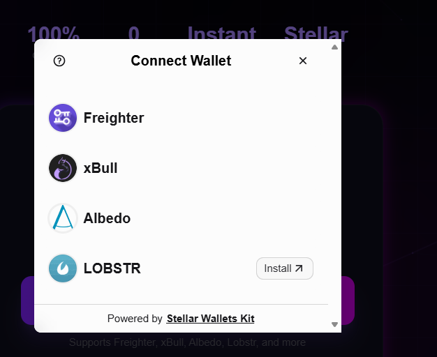
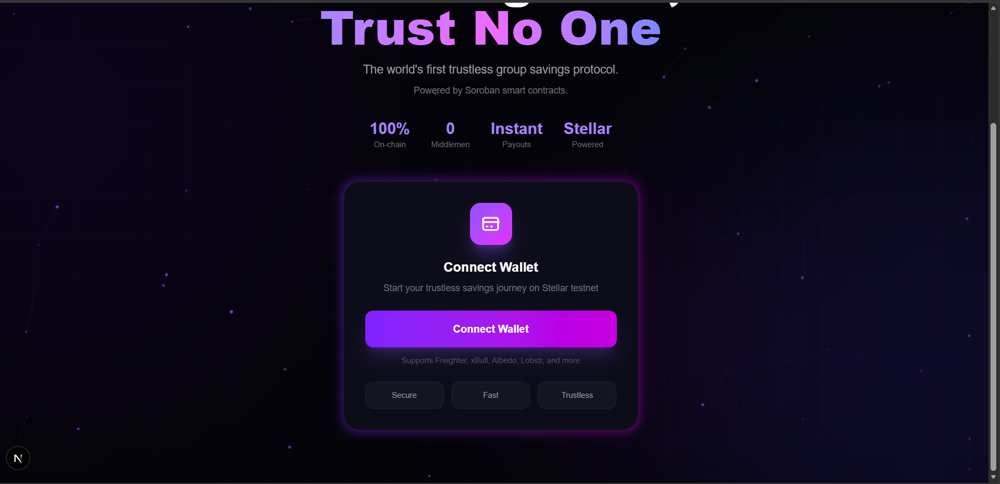
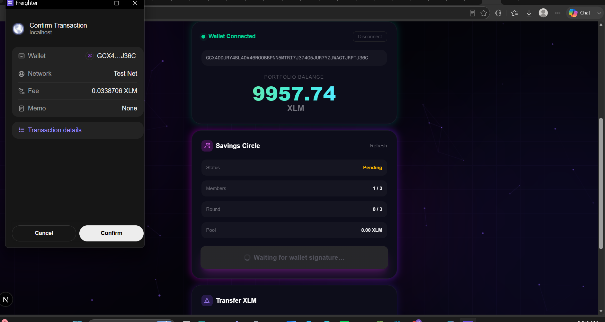
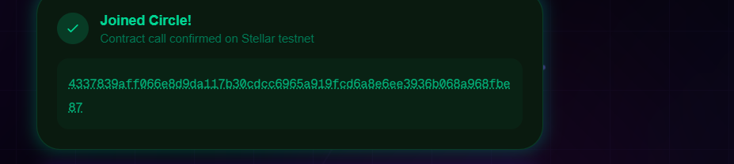
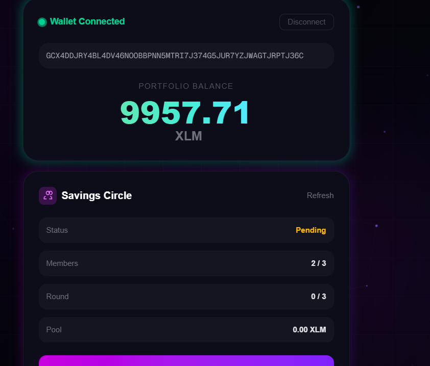

# ChitChain

[](https://github.com/Nishantk16/chitchain/actions/workflows/ci.yml)

> The world's first trustless group savings protocol (ROSCA) built on Stellar/Soroban.

## 🟠 Level 3 — Orange Belt 

This submission moves ChitChain from a Level 2 demo to a production-shaped dApp: real cross-contract calls between `chit_chain` and `registry`, live on-chain event streaming, an automated CI/CD pipeline, mobile-responsive UI, and a real test suite for both the contracts and the frontend.

**What's new in Level 3:**
- ✅ **Inter-contract communication** — `chit_chain` calls `registry.update_circle_status()` cross-contract whenever a circle becomes Active or Completed, so the registry stays in sync without any off-chain indexer. (Building this surfaced and fixed a real auth bug — see [Inter-Contract Communication](#-inter-contract-communication) below.)
- ✅ **Event streaming & real-time updates** — the frontend polls Soroban RPC's `getEvents` for the deployed `chit_chain` contract and renders a live "Live Activity" feed (Member Joined, Circle Activated, Round Started, Deposit, Payout, etc.) with no page refresh needed.
- ✅ **CI/CD pipeline** (GitHub Actions, badge above) — every push/PR runs both contracts' test suites + a release wasm build, and the frontend's lint, unit tests, type check, and production build.
- ✅ **Mobile responsive frontend** — verified down to a 320px viewport (iPhone SE-class), no horizontal overflow or clipped text.
- ✅ **Contract upgrade workflow** — both contracts ship an admin-gated `upgrade()` (in-place WASM swap via `Env::deployer()`), used for real during this submission to ship the auth fix below without losing the deployed `chit_chain` address or its on-chain member/round history.
- ✅ **Tests for contracts and frontend** — 21 Rust contract tests (Soroban SDK test harness) + 27 frontend unit tests (Vitest), all running in CI.

### 🔧 Inter-Contract Communication

`chit_chain` and `registry` are two independently deployed contracts. `chit_chain` holds `registry`'s address in its own storage and calls it directly — a real cross-contract invocation, not a shared library or an off-chain relay:

- `initialize()` → `registry.register_circle(circle, name, admin)`
- `join_circle()` (once the circle fills up) → `registry.update_circle_status(circle, Active)`
- `execute_payout()` (once the final round completes) → `registry.update_circle_status(circle, Completed)`

**A real bug this surfaced:** `registry.update_circle_status()` originally required the *circle's admin* to sign (`entry.admin.require_auth()`). That works fine for `initialize()`, which the admin submits directly — but `join_circle()` is submitted by a regular *member*, not the admin. The member's transaction has no admin signature attached, so the cross-contract call failed with `HostError: Error(Auth, InvalidAction)` the moment a circle's 3rd member joined on testnet.

The fix: require auth from the **calling contract itself** (`circle.require_auth()`) instead of the stored admin. A contract's own `require_auth()` inside a cross-contract call it initiated is satisfied automatically — no manual signature needed — so this correctly restricts the update to the registered circle contract without depending on who happens to be signing the outer transaction. Shipped via the upgrade workflow above, with a fresh `registry` deployment (its original instance had no `upgrade()` capability yet) and `chit_chain.set_registry_contract()` repointing the existing, already-deployed circle at it.

| Step | Tx Hash |
|---|---|
| Deploy fixed `registry` | [`21d9f297edfd5aac2f51ef5784ae35d920ab7624b9e2161919ce880d68192be8`](https://stellar.expert/explorer/testnet/tx/21d9f297edfd5aac2f51ef5784ae35d920ab7624b9e2161919ce880d68192be8) |
| Upgrade deployed `chit_chain` to v2 | [`87ddfb769a2ce2bfa49552e27a7cd59c0c1397db92ad463e4dd58ddd2f3a4cc8`](https://stellar.expert/explorer/testnet/tx/87ddfb769a2ce2bfa49552e27a7cd59c0c1397db92ad463e4dd58ddd2f3a4cc8) |
| Repoint `chit_chain` at the fixed registry | [`f948d1ba29351d68d150ea4f1f7fc731999bc5962e5decf6f478aacf7740601e`](https://stellar.expert/explorer/testnet/tx/f948d1ba29351d68d150ea4f1f7fc731999bc5962e5decf6f478aacf7740601e) |
| `join_circle` succeeding post-fix (3rd member, frontend + Freighter) | Verified live — circle flipped to `Active`, Round 1 started, confirmed in the Live Activity feed |

### 🧪 Testing

```bash
# Contracts (21 tests, both packages)
cargo test --workspace

# Frontend (27 tests)
cd frontend && npm test
```

Both suites run automatically in CI on every push — see the badge at the top of this file or the [Actions tab](https://github.com/Nishantk16/chitchain/actions).

## 🟡 Level 2 — Yellow Belt (Rise In)

This submission adds multi-wallet integration, real smart contract deployment, and live contract calls with full transaction status tracking on top of the White Belt (Level 1) foundation.

**What's new in Level 2:**
- ✅ Multi-wallet support via **StellarWalletsKit** (Freighter, xBull, Albedo, LOBSTR)
- ✅ Two Soroban smart contracts (`chit_chain` + `registry`) deployed to **Stellar Testnet**
- ✅ Real contract calls from the frontend — reading circle state (`get_circle_state`) and writing to the chain (`join_circle`)
- ✅ End-to-end transaction status tracking: building → simulating → signing → submitting → confirming → success/failed
- ✅ 3 distinct, user-facing error types: **wallet not found**, **user rejected**, and **contract call failed** (e.g. already a member, circle full, insufficient balance)

### 📸 Screenshots

**Wallet options (multi-wallet modal)**



**Landing page**



**Signing a real contract call (Freighter)**



**Contract call confirmed on-chain**



**Circle state updated after the call (read back from the contract)**



### 📜 Deployed Contracts (Testnet)

| Contract | Address |
|---|---|
| `chit_chain` | [`CCDX7VIOZOHJDDKN4QO2OE2IIF4GZOPATPMDHHEEHGVMPH6XXYNIZF54`](https://stellar.expert/explorer/testnet/contract/CCDX7VIOZOHJDDKN4QO2OE2IIF4GZOPATPMDHHEEHGVMPH6XXYNIZF54) |
| `registry` | [`CDFDWQAWRA6ZJVHG3Q4MR6ODHZZ6MG7IFJ3SFBRJIPDBXNWWMPBRCHM6`](https://stellar.expert/explorer/testnet/contract/CDFDWQAWRA6ZJVHG3Q4MR6ODHZZ6MG7IFJ3SFBRJIPDBXNWWMPBRCHM6) |

### 🔗 Verifiable Transaction Hashes

| Call | Hash |
|---|---|
| `join_circle` (via CLI) | [`bac97dc878363936e4e3ec704dfc260f602bd2774adcf056dd0a1d84f7abcca6`](https://stellar.expert/explorer/testnet/tx/bac97dc878363936e4e3ec704dfc260f602bd2774adcf056dd0a1d84f7abcca6) |
| `join_circle` (via frontend, Freighter) | [`4337839aff066e8d9da117b30cdcc6965a919fcd6a8e6ee3936b068a968fbe87`](https://stellar.expert/explorer/testnet/tx/4337839aff066e8d9da117b30cdcc6965a919fcd6a8e6ee3936b068a968fbe87) |

## Project Description

ChitChain is a decentralized group-savings (chit fund / ROSCA) application built on Stellar. It eliminates fraud and middlemen from traditional chit funds by putting circle membership, deposits, winner selection, and payouts entirely on-chain via two Soroban smart contracts:

- **`chit_chain`** — manages a single savings circle's lifecycle: joining, depositing, selecting a round winner, and executing payouts.
- **`registry`** — a lightweight on-chain directory that tracks every circle created and its current status, so circles can be discovered and monitored independently of the frontend.

## Live Demo

🌐 **[https://chit-chain.vercel.app](https://chit-chain.vercel.app)**

## Tech Stack

- Next.js 16 + TypeScript + Tailwind CSS
- `@stellar/stellar-sdk` (Soroban RPC, contract read/write, event streaming)
- `@creit.tech/stellar-wallets-kit` (multi-wallet: Freighter, xBull, Albedo, LOBSTR)
- Soroban smart contracts in Rust (`soroban-sdk` 21.7.6)
- Vitest (frontend unit tests) + the Soroban SDK test harness (contract tests)
- GitHub Actions (CI/CD)
- Vercel (frontend deployment) + Stellar Testnet (contracts)

## Setup Instructions

### Prerequisites
- Node.js 20+
- Rust 1.82+ and the `wasm32v1-none` target (`rustup target add wasm32v1-none`)
- [Stellar CLI](https://developers.stellar.org/docs/tools/developer-tools/cli/stellar-cli) 22+
- A Stellar wallet browser extension (Freighter, xBull, Albedo, or LOBSTR)

### Run the frontend locally

```bash
git clone https://github.com/Nishantk16/chitchain
cd chitchain/frontend
npm install --ignore-scripts
```

Create `frontend/.env.local`:

```
NEXT_PUBLIC_CHIT_CHAIN_CONTRACT=CCDX7VIOZOHJDDKN4QO2OE2IIF4GZOPATPMDHHEEHGVMPH6XXYNIZF54
NEXT_PUBLIC_REGISTRY_CONTRACT=CDFDWQAWRA6ZJVHG3Q4MR6ODHZZ6MG7IFJ3SFBRJIPDBXNWWMPBRCHM6
NEXT_PUBLIC_XLM_TOKEN_ADDRESS=CDLZFC3SYJYDZT7K67VZ75HPJVIEUVNIXF47ZG2FB2RMQQVU2HHGCYSC
NEXT_PUBLIC_STELLAR_RPC_URL=https://soroban-testnet.stellar.org
NEXT_PUBLIC_HORIZON_URL=https://horizon-testnet.stellar.org
```

```bash
npm run dev
```

### Build & deploy the contracts yourself

```bash
cd contracts   # workspace root: chit_chain + registry
rustup target add wasm32v1-none
cargo build --target wasm32v1-none --release

stellar contract deploy \
  --wasm target/wasm32v1-none/release/registry.wasm \
  --source <your-identity> --network testnet

stellar contract deploy \
  --wasm target/wasm32v1-none/release/chit_chain.wasm \
  --source <your-identity> --network testnet
```

> **Note on the WASM target:** Recent Rust toolchains (1.82+) emit post-MVP WASM features (`reference-types`) by default, which the current Soroban host does not yet support. Building for `wasm32v1-none` (instead of `wasm32-unknown-unknown`) produces MVP-compatible WASM and resolves the `HostError: Error(WasmVm, InvalidAction)` simulation failure you'd otherwise see on deploy.

## Level 1 Recap (White Belt)

- Connect/disconnect Freighter wallet
- Display XLM balance in real-time
- Send XLM transactions on Stellar testnet
- Transaction hash with Stellar Explorer link
- Success/failure feedback

---
_Deployed via Vercel + GitHub integration (Level 2)._
